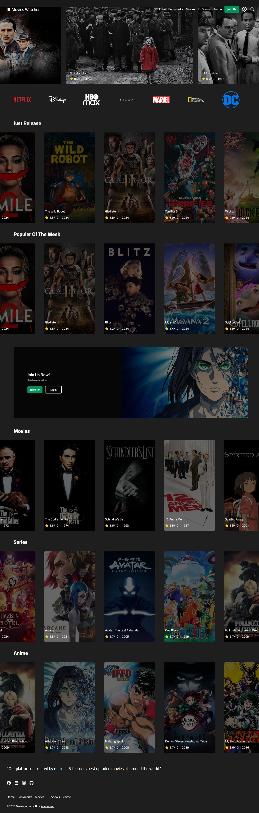
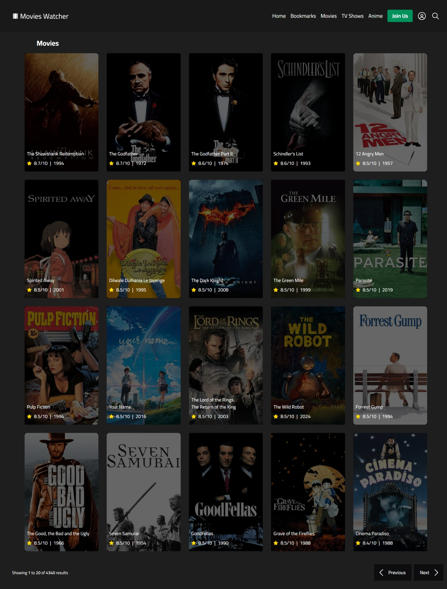
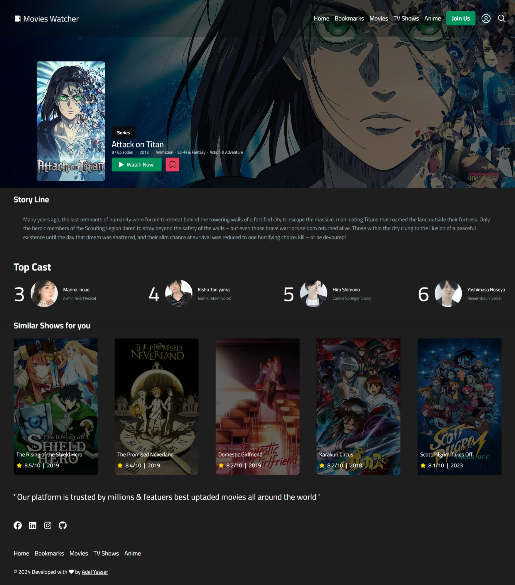

# Movies Watcher 🎥

**Movies Watcher** is a web application designed to help users manage and track their favorite movies. Add movies to your watchlist, mark them as watched, and explore your collection seamlessly with a clean and responsive design.

---

## 🚀 Features

- **Add Movies**: Create a personalized watchlist.
- **Mark as Watched**: Keep track of the movies you’ve seen.
- **Search Movies**: Quickly find movies in your library.
- **Interactive UI**: Modern and user-friendly interface.

---

## 🎬 Demo

You can try out the live demo of the Movies Watcher application here:  
[Movies Watcher Demo](https://movies-watcher.vercel.app)

---

## 📂 Repository Structure

```plaintext
movies-watcher/
├── public/          # Static assets
├── src/             # Source code
│   ├── components/  # Reusable UI components
│   ├── pages/       # Application pages
│   ├── styles/      # CSS and styling files
│   ├── utils/       # Utility functions
│   └── App.js       # Main application file
├── Screenshots/     # Folder containing app screenshots
│   ├── HomePage.jpeg
│   ├── MoviesPage.jpeg
│   └── ShowPage.jpeg
├── package.json     # Project dependencies and scripts
├── README.md        # Project documentation
└── .gitignore       # Git ignored files
```

---

## 🛠️ Installation

Follow these steps to set up the project locally:

1. **Clone the repository**:

   ```bash
   git clone https://github.com/dola5xd/movies-watcher.git
   cd movies-watcher

   ```

2. **Install dependencies:**:

   ```bash
   npm install

   ```

3. **Run the development server:**:

   ```bash
   npm run dev

   ```

4. **Open your browser and visit: http://localhost:3000.**

---

## 🖼️ Screenshots

### Home Page



### Movies Page



### Show Page



---

## 💡 Technologies Used

### Frontend:

- **Next.js**: A React framework for server-side rendering and building scalable web applications.
- **React**: A JavaScript library for building user interfaces.
- **React DOM**: Used for DOM rendering in React apps.
- **Tailwind CSS**: A utility-first CSS framework for rapid UI development.
- **Tailwind CSS Animate**: Adds pre-designed animations to Tailwind CSS.
- **Swiper**: A modern touch slider and framework.
- **Framer Motion**: For animations and transitions in React.
- **React Icons**: Popular icons as React components.
- **React Toastify**: Notifications for React applications.
- **React Hook Form**: Simplified forms management with validation.

### Backend:

- **Appwrite**: A backend-as-a-service platform for authentication, databases, and storage.

### Development Tools:

- **TypeScript**: For type-safe JavaScript development.
- **ESLint**: A static code analysis tool to find and fix problems in JavaScript/TypeScript.
- **PostCSS**: A tool to transform styles using JavaScript plugins.

---

## 🤝 Contributing

Contributions are welcome!

1. Fork the repository.

2. Create a feature branch:

   ```bash
   git checkout -b feature/YourFeature
   ```

3. Commit your changes:

```bash
git commit -m "Add a new feature"
```

4. Push to the branch:

```bash
git push origin feature/YourFeature
```

5. Open a pull request.

---

## 📜 License

This project is licensed under the [MIT License](LICENSE).
